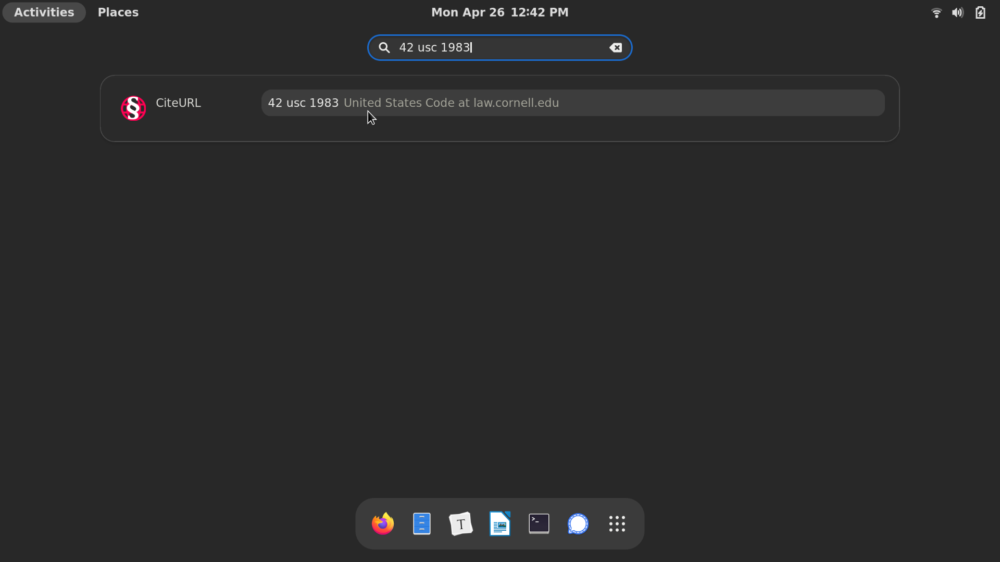

This is a search provider for the GNOME Shell that lets you look up legal citations using [CiteURL](https://github.com/raindrum/citeurl/). For example, here are some search terms and their respective links:

- [CA Public Resources Code 21000](https://leginfo.legislature.ca.gov/faces/codes_displaySection.xhtml?lawCode=PRC&sectionNum=21000)
- [42 usc 1983](https://www.law.cornell.edu/uscode/text/42/1983)
- [347 U.S. 483, 495](https://cite.case.law/us/347/483/#p495)
- [U.S. Constitution Amendment XIV, Section 3](https://constitution.congress.gov/browse/amendment-14/#14_S3)

By default, this extension recognizes citations to U.S. state and federal court cases, statutes, and constitutions, among other sources of law. For the complete list, see [CiteURL's built-in templates](https://github.com/raindrum/citeurl/blob/main/citeurl/builtin-templates.yaml).

# Configuration

Besides the built-in sources of law, CiteURL allows you to add support for more bodies of law by writing custom citation templates in YAML format. If you want to do that, you can follow [this guide](https://raindrum.github.io/citeurl/#template-yamls).

Once you've made your own YAML file, you can use the `citeurl-makejs` command to export the custom templates into a `citeurlCustom.js` file in the extension folder.

To do that, first ensure that CiteURL is installed:

```bash
python -m pip3 install citeurl
```

Next, run the following command:

```bash
citeurl-makejs -o ~/.local/share/gnome-shell/extensions/gnome-citeurl-search-provider@raindrum.github.io/citeurlCustom.js PATH_TO_YOUR_TEMPLATES.YAML
```

Alternatively, if you want your templates to *replace* the built-in templates instead of supplement them, add the `-n` option to the above command.

Either way, configuration changes will take effect on your next login.

# Reporting Issues

This extension relies entirely on CiteURL for the ability to detect citations and translate them into URLs. So if there is an issue with a particular citation template (e.g. it generates broken links or doesn't recognize a particular citation), please use [CiteURL's issues page](https://github.com/raindrum/citeurl/issues) instead of this one.

This project's issues page is the place to report issues with its function as a GNOME extension specifically, like if it fails to load or generate any search results.

# Python Implementation

This extension is written in JavaScript so that it can be installed easily from [extensions.gnome.org](https://extensions.gnome.org/). That said, it was originally made in Python so as to be more compatible with the underlying [CiteURL](https://github.com/raindrum/citeurl/) library, and so that the citation templates could be loaded directly in YAML format without conversion to JavaScript.

If you want to install the original Python-based version, you can find it [here](https://github.com/raindrum/gnome-citeurl-search-provider/tree/main/python-implementation).